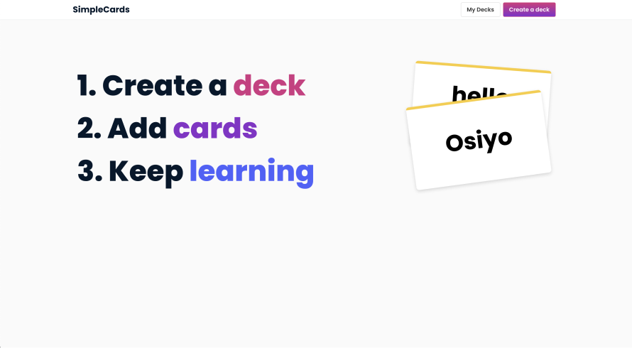
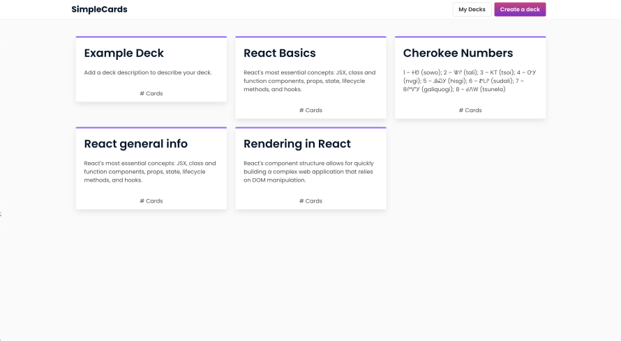
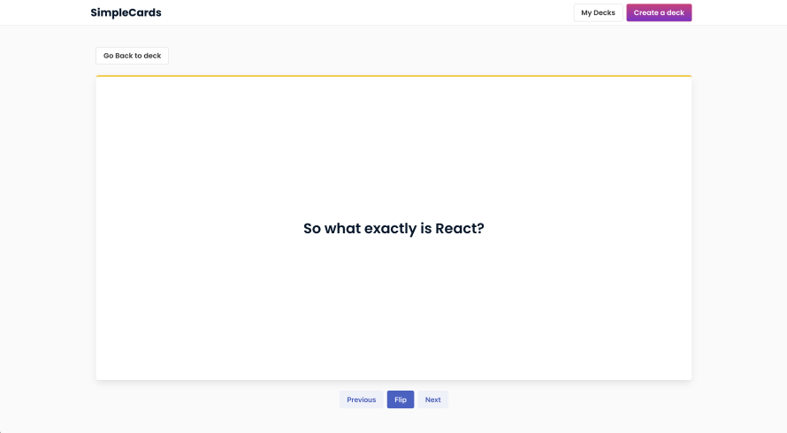

## SimpleCards App

Simple Cards is a simple web application for creating and studying a deck of flashcards. A user can create, edit and delete a deck of flashcards or individual cards. When a user reviews a deck of cards, they're shown one at a time with the ability to flip front to back.

